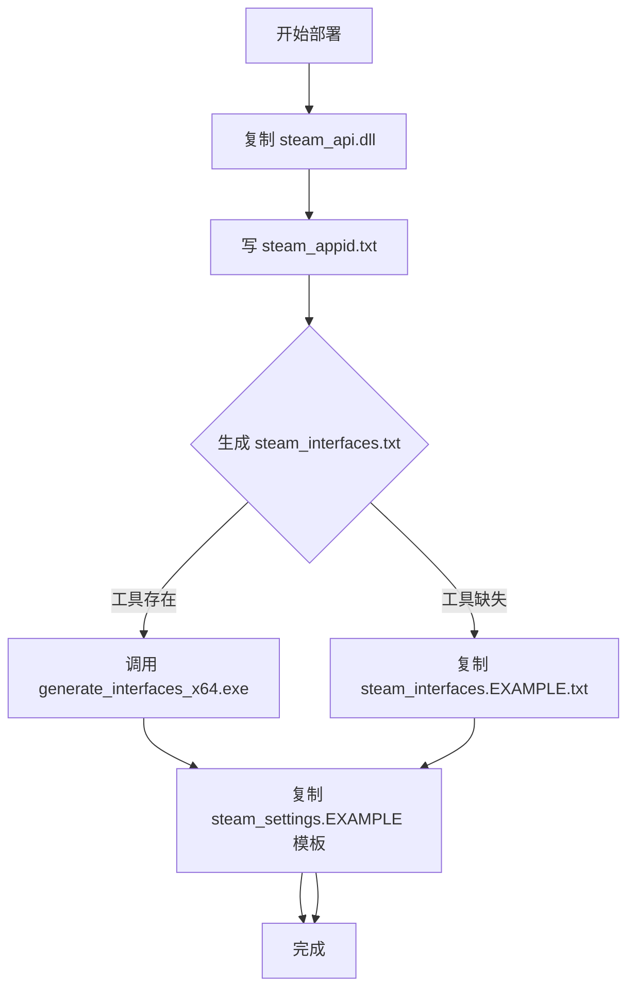

# NoSteamLauncher 开发计划 v3

> 记录 OSTGUI「免Steam启动」功能完整开发过程，供后续维护/扩展参考。

---

## 1. 整体架构

```
NoSteamLauncher (独立控制台工具)
├── SteamlessService       # Steamless 脱壳封装
├── GBEDeploymentService   # GBE 部署封装
├── NoSteamLaunchOrchestrator  # 编排器（总控）
└── Models                 # 数据模型
```

**核心流程：**
```
用户选游戏 → Steamless 脱壳 → 替换 EXE → 部署 GBE → 验证启动
```

---

## 2. 核心模块详细设计

### 2.1 SteamlessService (Services/SteamlessService.cs)

**职责**：封装 Steamless.CLI.exe 调用，处理依赖 DLL 复制，解析输出。

**关键实现点：**

| 问题 | 解决方案 |
|------|----------|
| 依赖 DLL 找不到 | 运行前将 `Steamless.API.dll`、`SharpDisasm.dll` 复制到游戏目录 |
| 输出文件名变体 | 支持 `.unbind.exe`、`_unpacked.exe`、`-unpacked.exe`、`.unpacked.exe`、`.exe.unpacked.exe` |
| 编码问题 | 进程输出重定向，UTF-8 处理 |
| 超时/异常 | CancellationToken + try-catch，返回结构化结果 |

**核心方法：**
```csharp
Task<SteamlessResult> UnpackAsync(string exePath, bool verbose, CancellationToken ct)
```

**输出结构：**
```csharp
class SteamlessResult {
    bool Success;
    string? UnpackedExePath;
    string? ErrorMessage;
    int ExitCode;
    string[] OutputLines;
}
```

**已修复 Bug：**
- ✅ `FindUnpackedExe` 增加 `.exe.unpacked.exe` 后缀匹配
- ✅ 移除对 `Steamless.API.dll`/`SharpDisasm.dll` 复制到游戏目录（Steamless 从自身 Plugins 目录加载）
- ✅ 修复 `workDir` 变量作用域问题

---

### 2.2 GBEDeploymentService (Services/GBEDeploymentService.cs)

**职责**：部署 Goldberg Steam Emulator 运行时文件。

**部署清单：**

| 文件/目录 | 说明 |
|-----------|------|
| `steam_api.dll` / `steam_api64.dll` | 核心模拟器 DLL（根据 EXE 架构选择 x86/x64） |
| `steam_appid.txt` | 游戏 AppID（游戏目录 + steam_settings/ 双份） |
| `steam_interfaces.txt` | 接口版本列表（工具生成/模板回退） |
| `steam_settings/` | 完整配置目录（53 文件） |

**核心流程：**



**关键实现点：**

| 功能 | 实现 |
|------|------|
| 架构检测 | PE 头 `Machine` 字段（0x8664 = x64） |
| 接口生成 | 优先 `generate_interfaces_x64.exe`，失败回退模板 |
| 模板部署 | 递归复制 `steam_settings.EXAMPLE/` 全量文件，保留目录结构 |
| 配置合并 | 部署后强制更新 `steam_appid.txt` 为当前 AppID |
| UE 游戏支持 | `--ue-engine` 指定 Engine 目录，部署到 Engine/Binaries/ThirdParty/Steamworks/ |

**已修复 Bug：**
- ✅ `File.Copy(sourceDll, targetDllPath, true)` 修复目标路径拼接
- ✅ `GenerateInterfacesAsync` 所有分支返回值修复
- ✅ `DeploySettingsFiles` 递归复制子目录（controller.EXAMPLE、http.EXAMPLE 等）

---

### 2.3 NoSteamLaunchOrchestrator (Services/NoSteamLaunchOrchestrator.cs)

**职责**：编排全流程，错误处理、日志、结果聚合。

**流程控制：**

```csharp
async Task<LaunchResult> ExecuteAsync(LaunchOptions options) {
    // 1. 备份原 EXE
    // 2. Steamless 脱壳（失败不阻断，记录警告继续）
    // 3. 替换 EXE（成功才替换）
    // 4. GBE 部署
    // 5. 可选：启动验证（5秒超时）
}
```

**关键决策：**
- Steamless 失败（无 SteamStub）→ **不报错**，记录警告，用原 EXE 继续部署 GBE
- 仅 Steamless 成功且有解包文件时才替换 EXE

---

### 2.4 SteamlessService (Services/SteamlessService.cs)

**依赖处理：**
- 自动复制 `Steamless.API.dll`、`SharpDisasm.dll` 到游戏目录（Steamless 运行时从工作目录加载 Plugins）
- 工作目录 = 游戏 EXE 所在目录

**输出文件名匹配模式：**
```
Game.exe.unbind.exe
Game_unpacked.exe
Game-unpacked.exe
Game.unpacked.exe
Game.exe.unpacked.exe  ← 新增支持
```

---

### 2.5 NoSteamLaunchOrchestrator (Services/NoSteamLaunchOrchestrator.cs)

**启动验证：**
```csharp
// 启动进程 → 等待 5 秒 → 检查 HasExited
// 退出码 0 = 成功，非 0 = 警告但不判定失败
```

---

### 2.6 Program.cs (入口)

**CLI 参数：**

| 参数 | 必填 | 说明 |
|------|------|------|
| `--exe` | 是 | 游戏 EXE 路径 |
| `--appid` | 是 | Steam AppID |
| `--ue` | 否 | UE 游戏标记 |
| `--ue-engine` | 条件 | UE Engine 路径 |
| `--steamless` | 否 | Steamless.CLI.exe 路径 |
| `--gbe-dll` | 否 | steam_api64.dll 路径 |
| `--gbe-dll32` | 否 | steam_api.dll (x86) 路径 |
| `--gen-interfaces-tool` | 否 | generate_interfaces_x64.exe 路径 |
| `--backup` | 否 | 备份原 EXE |
| `--gen-interfaces` | 否 | 生成 steam_interfaces.txt |
| `--dry-run` | 否 | 仅模拟不修改 |
| `--verbose` | 否 | 详细日志 |

**默认路径解析：**
```
baseDir = AppContext.BaseDirectory
Resources/Steamless.CLI.exe
Resources/steam_api64.dll
Resources/steam_api.dll
Resources/generate_interfaces_x64.exe
Resources/steam_settings.EXAMPLE/
```

---

## 3. 资源文件结构 (Resources/)

```
Resources/
├── Steamless.CLI.exe           # 113 KB
├── Steamless.API.dll           # 34 KB
├── SharpDisasm.dll             # 220 KB
├── steam_api.dll (x86)         # 2.5 MB
├── steam_api64.dll             # 3.2 MB
├── generate_interfaces_x64.exe # 289 KB
├── steam_settings.EXAMPLE/     # 53 文件模板
│   ├── achievements_EXAMPLE.json
│   ├── DLC.EXAMPLE.txt
│   ├── force_*.txt
│   ├── controller.EXAMPLE/
│   ├── http.EXAMPLE/
│   └── ...
├── steam_interfaces.EXAMPLE.txt
├── steam_appid.EDIT_AND_RENAME.txt
└── Plugins/                    # Steamless 插件目录
    ├── Steamless.API.dll
    ├── SharpDisasm.dll
    └── Steamless.Unpacker.Variant*.dll (8个)
```

---

## 4. 已验证测试用例

| 游戏 | AppID | 引擎 | SteamStub | 结果 |
|------|-------|------|-----------|------|
| Ib | 1901370 | NW.js | Variant 3.1 | ✅ 完整流程跑通 |
| Chill with You | 3548580 | Unity | 无 | ✅ 部署成功（无 Stub） |

---

## 5. 已知问题 / 待办

| 项 | 状态 | 说明 |
|----|------|------|
| `generate_interfaces_x64.exe` | ✅ 已编译部署 | 从 GBE fork 编译，289 KB |
| `generate_interfaces_x64.exe` 调用 | ✅ 调用正常 | 已测试生成 `steam_interfaces.txt` |
| `steam_settings.EXAMPLE` 部署 | ✅ 53 文件全量 | 含 controller、http、mods 子目录 |
| UE 游戏路径自动检测 | ❌ 未实现 | 需手动 `--ue-engine` |
| DLC.txt 自动生成 | ❌ 未实现 | 需从清单/Lua 解析 |
| x86 游戏支持 | ⚠️ 代码就绪 | 待测试 |
| 进度条/取消 | ❌ UI 层待做 | 需集成到 OSTGUI |
| 错误回滚 | ⚠️ 仅备份 | 失败需手动恢复 `.bak` |

---

## 6. 后续开发优先级

| 优先级 | 任务 | 预估工时 |
|-------|------|---------|
| P0 | OSTGUI 集成「免Steam启动」页面 | 2-3 天 |
| P0 | UE 游戏 Engine 路径自动检测 | 0.5 天 |
| P1 | DLC.txt / force_*.txt 自动生成 | 1 天 |
| P1 | 进度条 / 取消 / 错误回滚 UI | 1 天 |
| P2 | x86 游戏测试验证 | 0.5 天 |
| P2 | 错误自动回滚（失败恢复 .bak） | 0.5 天 |
| P3 | 批量处理 / 队列 | 1 天 |

---

## 6. 关键文件索引

| 文件 | 说明 |
|------|------|
| `Services/SteamlessService.cs` | Steamless 封装 |
| `Services/GBEDeploymentService.cs` | GBE 部署核心 |
| `Services/NoSteamLaunchOrchestrator.cs` | 编排器 |
| `Models/LaunchOptions.cs` | 数据模型 |
| `Program.cs` | CLI 入口 |
| `Resources/` | 内嵌工具/模板 |
| `Resources/steam_settings.EXAMPLE/` | 53 文件模板 |
| `Resources/generate_interfaces_x64.exe` | 接口生成工具 |

---

## 7. 运行示例

```bash
# 完整部署（带备份、生成接口、详细日志）
NoSteamLauncher.exe --exe "D:\Games\Game.exe" --appid 123456 --backup --gen-interfaces --verbose

# UE 游戏（指定 Engine 路径）
NoSteamLauncher.exe --exe "Game.exe" --appid 123456 --ue --ue-engine "D:\UE_5.3\Engine" --backup --verbose

# 仅干跑（不修改文件）
NoSteamLauncher.exe --exe "Game.exe" --appid 123456 --dry-run --verbose
```

---

## 7. 资源文件来源

| 文件 | 来源 |
|------|------|
| `Steamless.CLI.exe` + Plugins | `SteamAutoCracker/Steamless_CLI/` |
| `steam_api.dll` / `steam_api64.dll` | `SteamAutoCracker/sac_emu/game_goldberg/files/` |
| `steam_settings.EXAMPLE/` | `goldberg_emulator/files_example/steam_settings.EXAMPLE/` |
| `steam_interfaces.EXAMPLE.txt` | `goldberg_emulator/files_example/` |
| `generate_interfaces_x64.exe` | `goldberg_emulator/generate_interfaces_file.cpp` 自行编译 |

---

*文档版本：v3.0 | 更新日期：2026-08-17 | 维护者：OSTGUI 团队*